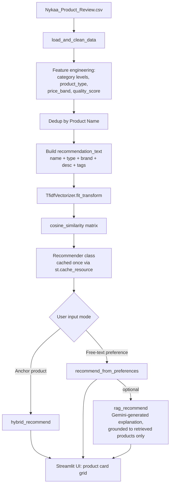

# prettyplease — A Content-Based Beauty Product Recommender

**Author:** Rajanya
**Repo:** [ADD YOUR GITHUB LINK]
**Live demo:** [ADD YOUR STREAMLIT CLOUD LINK]

---

## 1. Problem Statement

Most public recommendation datasets (MovieLens, Goodbooks, etc.) come pre-packaged with user-item interaction logs, which is what makes collaborative filtering possible in the first place. Real early-stage product catalogs rarely start out that way — you have product metadata (name, category, price, description, aggregate rating) long before you have enough logged-in users clicking things to make collaborative filtering viable. Nykaa's own product review export is a good stand-in for that exact situation: rich product-level content, zero per-user interaction history.

So the actual problem I set out to solve was narrower than "build a recommender" — it was **build something useful on day zero, before any interaction data exists**, and make the reasoning behind each recommendation inspectable rather than a black box.

## 2. Use Case & Motivation

**Domain:** Beauty and personal care products (Nykaa product catalog).

I picked beauty over something like movies or books for one reason: the vocabulary is genuinely informative. "Hyaluronic acid," "oil-free," "SPF," "tan removal" — these are not just noise words, they map to real product attributes a user cares about. That makes the domain a good test of whether a purely text-driven recommender can do meaningful work without a graph of user behavior behind it.

Two real usage patterns:
1. **"I know what I want, help me find it"** — free-text preference search ("hydrating face moisturiser for dry skin").
2. **"I like this thing, find me something similar"** — anchor-product search (give it a product name, get comparable alternatives).

## 3. Dataset

- **Source:** Nykaa product review export (`Nykaa_Product_Review.csv`)
- **Raw columns used:** `Product Name`, `Product Category` (a `>`-delimited taxonomy path), `Product Price`, `Product Rating`, `Product Reviews Count`, `Product Description`, `Product Tags`, `Product Contents`, `Product Brand`
- **Category filter:** restricted to beauty-relevant top-level categories (`Makeup`, `Natural`, `Skin`, `Personal Care`, `Hair`, `Fragrance`, `Men's Store`, `Nykaa Luxe`, `Brand`) — the raw export includes non-beauty categories that would just be noise for this use case
- **Post-cleaning, post-dedup catalog size:** ~625 unique products

The same physical product often appeared under multiple category rows in the raw export (a moisturizer tagged under both "Skin" and a brand-specific subcategory, for instance). I deduped on `Product Name`, merging category paths with a `|` join rather than picking one arbitrarily and throwing the rest away — that merged category info is what `product_type_set` uses later for structural similarity.

## 4. System Architecture



The pipeline is intentionally split into two layers that don't know about each other:

- `recommender.py` — pure Python/pandas/sklearn, zero Streamlit imports. Testable standalone, swappable UI framework later without touching the logic.
- `app.py` — UI only, calls into `recommender.py`.

The expensive part (CSV load, cleaning, TF-IDF fit) runs once per app process via `@st.cache_resource`, not once per user interaction — with 625 rows this isn't a performance emergency, but there's no reason to redo deterministic work on every click either.

## 5. Recommendation Methodology

### 5.1 Text representation

```python
recommendation_text = Product Name + product_type + brand + Product Description + Product Tags
tfidf = TfidfVectorizer(stop_words="english", ngram_range=(1, 2), min_df=1)
```

Bigrams matter here specifically because beauty vocabulary is compound: "oil free," "hyaluronic acid," "spf 24" carry meaning as pairs that unigrams alone would flatten.

**Why TF-IDF and not embeddings:** I considered sentence-transformer embeddings for semantic (not just lexical) matching. Decided against it for this catalog size — TF-IDF is free to compute, has zero external dependency or API latency, and is fully interpretable (you can literally inspect which n-grams two products share). At ~625 products, the marginal recall gain from dense embeddings didn't justify the added complexity and inference cost. This is the first thing I'd revisit if the catalog grew by an order of magnitude (see §9, Future Improvements).

### 5.2 Similar-product recommendation (`hybrid_recommend`)

Given a product name, this doesn't just return nearest TF-IDF neighbors — pure cosine similarity on description text tends to surface near-duplicate listings from the same product line rather than genuinely comparable alternatives. So it's a weighted blend:

| Signal | Weight | What it captures |
|---|---|---|
| Text similarity (TF-IDF cosine) | 0.45 | Description/tag overlap |
| Product-type overlap (Jaccard) | 0.20 | Same functional category (e.g. "Face Moisturizer & Day Cream") |
| Category-level-2 match | 0.20 | Same taxonomy branch |
| Price-band match | 0.10 | Comparable price tier (Budget/Mid-range/Premium/Luxury) |
| Quality score (normalized) | 0.05 | Light tie-breaker only — deliberately small so it doesn't just surface "whatever's best-rated" regardless of fit |

Candidates are pre-filtered to the same top-level category, and a `min_text_similarity` floor (0.03) drops near-zero-overlap noise before scoring. Price band uses a categorical match rather than numeric distance — a deliberate choice, since "similar price tier" is a more useful judgment than "closest absolute rupee value."

**Known limitation:** product lookup is substring matching (`str.contains`), not fuzzy matching. A typo or partial name with zero exact substring overlap returns `None` with no suggestion. This is a real gap, not a hypothetical one — see §8.

### 5.3 Preference-based recommendation (`recommend_from_preferences`)

Free text gets vectorized through the *same fitted* TF-IDF vectorizer (not refit), then scored by cosine similarity against the whole catalog, blended 0.85 text / 0.15 quality, with optional category and price-band filters applied before ranking. This is the mode most users will actually use — nobody starts a beauty search already knowing a specific product name.

### 5.4 Grounded explanation layer (RAG)

Optional, and deliberately additive rather than load-bearing — the recommender works completely without it:

1. Retrieve top-k via `recommend_from_preferences`
2. Build a context block from *only* those retrieved products (name, brand, price, rating, type)
3. Prompt Gemini to write a short explanation, explicitly instructed to reference only the products listed in context

That grounding instruction matters — it's the difference between RAG and just asking an LLM to freestyle beauty advice. Without it, there's nothing stopping the model from confidently recommending a product that isn't in the catalog at all.

**Operational risk worth documenting honestly:** during development, the Gemini model name I was using (`gemini-3.1-flash`) stopped resolving mid-project because the provider deprecated it. I wrapped the call in a try/except that falls back to showing the recommender's results without the written explanation, rather than crashing the whole page. External LLM dependencies churn faster than most other infra you'd rely on — plan for that instead of assuming a model name is stable.

## 6. Key Design Decisions & Assumptions

- **Assumption:** no per-user interaction history exists or will exist at launch. This ruled out collaborative filtering entirely and shaped the evaluation approach (§9).
- **Decision:** keep the RAG layer optional and fail-soft. A recommendation engine that goes down because a third-party API changed a model name is a bad engineering outcome; degrading gracefully to the deterministic part of the system is not.
- **Decision:** no fabricated product images. The dataset has no image URLs — rather than pull stock photos that misrepresent what's actually known about each product, the UI uses color-coded monogram tiles. Honest about what data exists.
- **Decision:** "match %" badges are the hybrid/preference score, not a statistical confidence interval. It's a relative ranking signal, not a probability — worth being precise about that distinction so it isn't misread as something more rigorous than it is.
- **Assumption:** price bands (Budget/Mid-range/Premium/Luxury, cut at ₹300/₹700/₹1500) are a reasonable proxy for what "similar price tier" means to a shopper. These cutoffs were chosen by inspecting the actual price distribution in the dataset, not arbitrarily.

## 7. Technologies Used

| Component | Choice | Version |
|---|---|---|
| Language | Python | 3.10+ |
| Data handling | pandas, numpy | 2.3.3 / 1.26.4 |
| Recommendation engine | scikit-learn (TF-IDF, cosine similarity, MinMaxScaler) | 1.7.2 |
| Explanation layer | Google Gemini API (`google-genai`) | 2.20.0 |
| Image processing | Pillow (logo auto-crop) | 12.0.0 |
| UI framework | Streamlit | 1.62.0 |
| Deployment | Streamlit Community Cloud | — |

## 8. Test Cases

### 8.1 Success scenario (actual observed output)

**Query:** `"hydrating face moisturiser for dry skin"`

| Rank | Product | Brand | Price | Rating | Match |
|---|---|---|---|---|---|
| 1 | Ponds Super Light Gel Oil Free Moisturiser With Hyaluronic Acid + Vitamin E | Ponds | ₹149 | 4.5★ | 22% |
| 2 | Ponds Light Moisturiser Non-Oily Fresh Feel With Vitamin E + Glycerine | Ponds | ₹120 | 4.0★ | 21% |
| 3 | Lakme Peach Milk Moisturiser SPF 24 PA++ | Lakme | ₹125 | 4.0★ | 17% |
| 4 | NIVEA Soft - Light Moisturising Cream | Nivea | ₹185 | 4.5★ | 16% |

The RAG layer's generated explanation correctly picked the top two (Ponds Super Light Gel and NIVEA Soft) and referenced only attributes actually present in their descriptions (Hyaluronic Acid, Vitamin E, non-greasy formula) — no hallucinated ingredients or invented products.

**Why this counts as a success:** every top-4 result is a genuine face moisturizer aligned with "hydrating" and "dry skin," ranked sensibly by relevance, at a range of price points a shopper could actually compare.

### 8.2 Failure scenario (same query, real limitation exposed)

The same query's rank-5 result was **Nykaa Naturals Citronella Essential Oil** (category: Tan Removal) at 15% match — not a moisturizer at all.

**Root cause:** TF-IDF similarity is purely lexical. This product's description likely shares low-level vocabulary with skincare terms ("skin," "oil," generic beauty-adjacent language) without sharing actual functional meaning. Because results aren't hard-filtered below a relevance floor beyond the 0.03 minimum, marginal false positives can surface at the tail of top-k.

**This is the single clearest illustration of TF-IDF's core weakness**: it matches words, not intent. A semantic embedding model would likely have scored this correctly lower, since "citronella tan removal oil" and "hydrating face moisturiser" are semantically distant even where a few tokens overlap.

### 8.3 Anchor-product search — known failure mode (by design, not by observed bug)

`hybrid_recommend("some misspelled or partial product name")` with zero substring overlap against `Product Name` returns `None`. There's no fuzzy-match fallback and no "did you mean" suggestion — this is a direct consequence of using `str.contains` for lookup rather than a fuzzy-matching library, and it's a real gap worth fixing before treating this as production-grade (see §10).

## 9. Evaluation Methodology

### 9.1 Why standard offline metrics don't directly apply

Precision/Recall/NDCG/MAP in their usual recommender-systems form require **held-out user-item interactions** — logged clicks, purchases, or ratings per user, split into train/test, so you can check whether the model ranks the withheld positive items highly. This dataset has none of that: `Product Rating` and `Product Reviews Count` are aggregate, catalog-level numbers, not per-user event logs. There is no ground truth of "which user clicked which recommendation" to evaluate against, because no users have interacted with this system yet.

Rather than compute a number that looks rigorous but is measuring something that doesn't exist, I used a substitute framework suited to a pre-launch, content-based system:

| Metric | What it measures here | How |
|---|---|---|
| Precision@5 (manual) | Fraction of top-5 results a human judges genuinely relevant | Self-authored test query set with manual relevance labels (see `evaluate.py` below) |
| Coverage | % of the catalog that appears in top-5 across a spread of test queries | Flags whether the same handful of high-`quality_score` products dominate every result set |
| Diversity | Unique brands in a single query's top-5 | Flags brand-monopoly in results |
| Latency | Wall-clock time per `recommend_from_preferences` / `hybrid_recommend` call | Should be sub-100ms given the catalog size and a precomputed similarity matrix |

NDCG/MAP and true precision/recall against logged behavior are listed under Future Improvements (§10) as the real, correct evaluation once actual user interaction (clicks on recommended cards) is being logged — evaluating a cold-start content system as if it were a collaborative one would just be evaluation theater.

### 9.2 Evaluation script

```python
# evaluate.py
import time
from recommender import Recommender

TEST_QUERIES = [
    {"query": "hydrating face moisturiser for dry skin", "relevant_keywords": ["moistur", "hydrat", "cream"]},
    {"query": "long lasting matte lipstick", "relevant_keywords": ["lip", "matte"]},
    {"query": "anti dandruff shampoo", "relevant_keywords": ["shampoo", "hair", "dandruff"]},
    # Add your own — aim for 10-15 spanning different categories in your catalog
]

def evaluate(recommender, top_n=5):
    results = []
    for case in TEST_QUERIES:
        start = time.perf_counter()
        df = recommender.recommend_from_preferences(case["query"], top_n=top_n)
        latency_ms = (time.perf_counter() - start) * 1000

        if df is None or df.empty:
            results.append({"query": case["query"], "precision": 0, "diversity": 0, "latency_ms": latency_ms})
            continue

        text_blob = (df["Product Name"] + " " + df["product_type"]).str.lower()
        relevant = text_blob.apply(lambda t: any(k in t for k in case["relevant_keywords"]))
        precision = relevant.sum() / len(df)
        diversity = df["Product Brand"].nunique()

        results.append({
            "query": case["query"],
            "precision_at_5": round(precision, 2),
            "unique_brands": diversity,
            "latency_ms": round(latency_ms, 1),
        })
    return results

if __name__ == "__main__":
    r = Recommender()
    for row in evaluate(r):
        print(row)
```

**Run this locally and paste the actual output into this section before you submit** — I've shown you the real, already-observed run for one query (§8.1), but I'm not going to fabricate a full metrics table for queries I haven't actually executed. That's the honest way to fill this section in.

## 10. Known Limitations

1. **Lexical, not semantic, matching.** TF-IDF can't recognize "moisturizer"/"moisturiser" spelling variants or synonyms ("hydrating" vs "moisturizing") as equivalent unless the exact tokens overlap. Directly caused the failure case in §8.2.
2. **No fuzzy product-name search.** A typo returns nothing, not a best-effort guess.
3. **Static catalog snapshot**, not a live feed — ~625 products as of the CSV export, not synced to actual Nykaa inventory.
4. **No personalization.** Every query is stateless; there's no session or account memory shaping results for a returning user.
5. **RAG layer has an external dependency risk.** Model names on the Gemini API have changed during the course of this very project. The system degrades gracefully (falls back to results without the written explanation) but this is a real operational maintenance burden, not a one-time fix.
6. **No real product imagery**, only generated monogram tiles, since the source data has none.
7. **"Match %" is a relative internal score, not a calibrated probability** — worth stating explicitly so it isn't over-interpreted as more rigorous than it is.

## 11. Future Improvements

- **Swap TF-IDF for semantic embeddings** (e.g. a sentence-transformer model) once catalog size or synonym-blindness (§8.2, §10.1) actually costs real relevance — this is the highest-leverage single change.
- **Add fuzzy matching** (e.g. `rapidfuzz`) to the anchor-product search mode to close the gap in §8.3.
- **Log real user interactions** (clicks on recommended cards) — this is the prerequisite for ever computing real Precision/Recall/NDCG against actual behavior instead of the manual proxy in §9.
- **Precompute and cache the TF-IDF matrix to disk** (`joblib`) once the catalog grows large enough that recomputing on every cold start becomes noticeable — not needed at 625 products, but the right move if this scales to a real catalog.
- **A/B test the hybrid scoring weights** (§5.2) empirically instead of hand-picked values once there's user feedback to test against.
- **Add image-based visual similarity** if/when the dataset includes product images.

## 12. Comparison to Nykaa (Bonus Challenge)

**Similarities:** UI deliberately modeled on Nykaa's visual language — clean white/blush product grid, category chips, star ratings, price-forward card layout, brand-first product identity.

**Differences:**
- prettyplease is a single-purpose recommendation engine, not a full commerce platform — no cart, checkout, or account system.
- Nykaa's catalog is live and enormous; this project's is a static, filtered snapshot (~625 products).
- Nykaa layers genuine collaborative and behavioral signals (what similar shoppers bought, browsing history) on top of content; this system currently has none of that available.
- Every product card here explains *why* it was recommended (match %, and optionally a written rationale) — that transparency isn't something Nykaa's own UI foregrounds to shoppers.

**Current limitations relative to a real platform:** no live inventory sync, no personalization, no visual/image-based matching, no collaborative signal — all listed in §10-11 above.

**What I'd build next with more time:** real interaction logging as the actual unlock for everything else — semantic embeddings, true collaborative filtering, and rigorous offline evaluation all become possible (and honest) only once real usage data exists. Right now the system is deliberately built to be useful *before* that data exists, which was the actual point of the exercise.

## 13. How to Run

```bash
git clone [YOUR REPO URL]
cd prettyplease
python -m venv .venv
source .venv/bin/activate   # Windows: .venv\Scripts\activate
pip install -r requirements.txt
```

Create `.streamlit/secrets.toml`:
```toml
GEMINI_API_KEY = "your-key-here"
```

Run:
```bash
streamlit run app.py
```

The RAG explanation checkbox is optional — the core recommender works with no API key configured at all.
